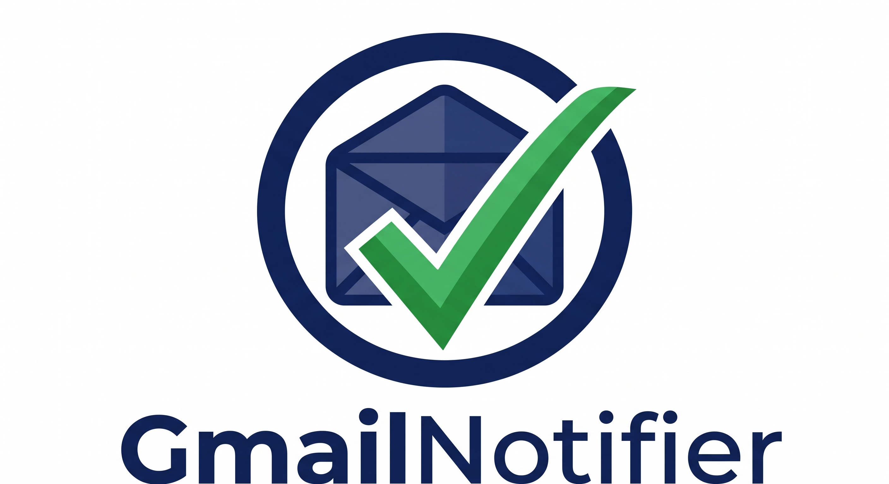

<p align="center">
  
</p>

<h1 align="center">gmailnotifier</h1>

<p align="center">
  A tiny, secure, multi-account Gmail unread-mail indicator for the macOS menu bar,
  powered by <a href="https://swiftbar.app">SwiftBar</a>.
</p>

---

## What it does

- Shows your total unread Gmail count in the menu bar, with a per-account breakdown and a preview of the most recent unread messages in the dropdown.
- Supports **multiple accounts** (personal Gmail and Google Workspace alike).
- Connects via **IMAP over TLS** (`imap.gmail.com:993`, TLS 1.2 minimum) — never sends your credentials anywhere except Google's own servers.
- Stores passwords **encrypted in the macOS Keychain**, or optionally fetches them on demand from **1Password** via the `op` CLI.
- Configures itself through native macOS dialogs — no editing config files by hand.

## Install

### Option 1 — Build from source (recommended)

```bash
git clone https://github.com/bricklen/gmailnotifier.git
cd gmailnotifier
make install
```

`make install` builds the binary and symlinks it into your SwiftBar plugin folder. The first time you launch the plugin (or click *Configure accounts…* in its dropdown) the setup wizard walks you through adding accounts.

You will also need:
- [SwiftBar](https://swiftbar.app) — `brew install swiftbar` (or download from the [SwiftBar releases page](https://github.com/swiftbar/SwiftBar/releases)).
- Go 1.22 or later — `brew install go`.

### Option 2 — Release binary

Download the latest archive from [Releases](https://github.com/bricklen/gmailnotifier/releases). Release binaries are **signed with a Developer ID and notarized by Apple**, so macOS Gatekeeper accepts them on first launch with no special steps. Verify the download before running:

```bash
shasum -a 256 -c SHA256SUMS
chmod +x gmailnotifier.30s-darwin-arm64        # or -amd64 on Intel Macs
./gmailnotifier.30s-darwin-arm64 setup
```

The setup wizard will offer to install the binary into your SwiftBar plugin folder automatically.

## First run

The wizard handles everything except the questions only you can answer:

1. **Your Gmail address.**
2. **An App Password** for that address — generate one at <https://myaccount.google.com/apppasswords>. (Your regular Google password will not work if 2-Step Verification is enabled, which it should be.)
3. **Where to keep the password:** macOS Keychain (default) or 1Password (only offered if `op` is installed and signed in).

The wizard tests the IMAP login before saving and immediately tells you whether the connection works. Repeat for as many accounts as you want.

To re-open the wizard later, click the menu-bar icon and choose **Configure accounts…**, or run `gmailnotifier setup` from a terminal.

## Security model

| What                                 | Where it lives                                                                  |
|--------------------------------------|---------------------------------------------------------------------------------|
| Account list (emails only)           | `~/Library/Application Support/gmailnotifier/accounts.toml` (mode `0600`)       |
| Passwords (Keychain backend)         | macOS Keychain, service `gmailnotifier`, account = email address                |
| Passwords (1Password backend)        | Never stored locally — fetched on each check via `op read "op://..."`           |
| Network                              | TLS 1.2+ to `imap.gmail.com:993`, server name verified                          |

- The config file never contains a password — only a *reference* describing where to find one.
- The binary never writes credentials to disk and never logs them.
- Connections fail closed: a single account's failure (network, auth, timeout) is shown in the dropdown but never blocks the rest of the bar.
- The code is small enough to audit end-to-end in one sitting; start at `cmd/gmailnotifier/main.go`.

## Migrating from the old `.creds_gmail` file

Earlier versions stored `email|password` lines in a plaintext `.creds_gmail` file. On first launch, the setup wizard detects that file and offers to:

1. Import every account into the Keychain.
2. Overwrite the plaintext file with zeros and delete it.

Nothing happens without your confirmation.

## 1Password integration

If `op` (the [1Password CLI](https://developer.1password.com/docs/cli/get-started/)) is installed and authenticated, the setup wizard offers it as a per-account password source. Store each Gmail App Password as a 1Password item and reference it with a secret reference like `op://Personal/Gmail/password`. The binary calls `op read --no-newline` on every refresh; nothing is cached on disk.

Only `op://` references are accepted; arbitrary strings are rejected to keep the CLI invocation safe.

## Layout

```
gmailnotifier/
├── cmd/gmailnotifier/main.go        # entry point
├── internal/
│   ├── config/                      # accounts.toml + legacy reader
│   ├── secrets/                     # Keychain + 1Password backends
│   ├── mail/                        # IMAP-over-TLS check
│   ├── output/                      # SwiftBar dropdown formatter
│   └── setup/                       # interactive wizard + osascript dialogs
├── docs/logo.png
├── Makefile
└── .github/workflows/ci.yml
```

## Plugin filename

SwiftBar (and xbar) use the filename to decide how often to refresh. `gmailnotifier.30s` runs every 30 seconds; rename to `gmailnotifier.1m`, `gmailnotifier.5m`, etc. as you like. SwiftBar accepts any executable — the extension does not matter.

## Development

```bash
make test      # go test -race -count=1 ./...
make vet       # go vet ./...
make build     # produces bin/gmailnotifier.30s
make dist      # cross-compiled binaries + SHA256SUMS in dist/
```

The macOS Keychain integration test is gated behind a build tag because it touches the real Keychain and may prompt for permission. Run it locally with:

```bash
go test -tags=keychain ./internal/secrets/...
```

## License

MIT — see [LICENSE](LICENSE).
